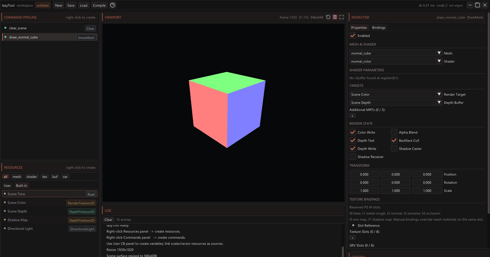
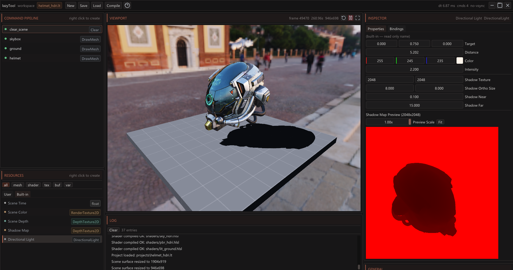

# lazyTool


**lazyTool** is an experimental 3D render-graph editor for building, inspecting, and iterating on real-time rendering pipelines with C++17, Win32, DirectX 11, HLSL, and Dear ImGui.

It is meant for fast shader iteration, GPU resource debugging, post-processing experiments, compute workflows, and visual prototyping without recompiling the engine for every rendering change.

> [!NOTE]
> This project was developed as a **vibe-coded, Codex-assisted** tool: the goal is rapid exploration, practical iteration, and turning rendering ideas into usable editor features quickly. The codebase is intentionally experimental, but the editor aims to stay transparent, inspectable, and useful for real graphics programming work.

> [!IMPORTANT]
> This README focuses on what the editor can do right now. Project/catalog management is intentionally left out for now.

---

## At a glance

| Area | Current capability |
|---|---|
| Rendering API | DirectX 11 |
| UI | Dear ImGui desktop editor |
| Shader workflow | Runtime HLSL compilation, reflection, and hot recompilation |
| Pipeline model | Command-based render graph / render pipeline list |
| Resources | Textures, render targets, 3D textures, buffers, meshes, shaders, values |
| Mesh import | Built-in primitives and glTF/GLB loading |
| Compute | Dispatch, repeat loops, UAV/SRV bindings, indirect dispatch |
| Draw commands | Mesh draw, instancing, MRTs, pixel UAV outputs, indirect draw |
| Lighting | Directional light and shadow map workflow |
| Debugging | Logs, resource previews, shader errors, binding inspection |
| Profiling | DX11 timestamp-based GPU timings per frame and per command |
| Persistence | Simple `.lt` scene-state save/load format |

---

## Contents

- [What it is](#what-it-is)
- [Quick start](#quick-start)
- [Technical stack](#technical-stack)
- [Requirements](#requirements)
- [Build and run](#build-and-run)
- [Interface overview](#interface-overview)
- [What you can do right now](#what-you-can-do-right-now)
- [Available commands](#available-commands)
- [DrawMesh and DrawInstanced](#drawmesh-and-drawinstanced)
- [MRT: Multiple Render Targets](#mrt-multiple-render-targets)
- [Pixel UAV outputs](#pixel-uav-outputs)
- [Compute dispatch](#compute-dispatch)
- [Repeat for compute iterations](#repeat-for-compute-iterations)
- [Indirect draw / indirect dispatch](#indirect-draw--indirect-dispatch)
- [Built-in resources](#built-in-resources)
- [Directional lighting and shadows](#directional-lighting-and-shadows)
- [Camera and navigation](#camera-and-navigation)
- [Viewport runtime](#viewport-runtime)
- [Profiling and status](#profiling-and-status)
- [Integrated log](#integrated-log)
- [Inspector](#inspector)
- [Bindings and slot conventions](#bindings-and-slot-conventions)
- [Keyboard shortcuts](#keyboard-shortcuts)
- [Basic persistence](#basic-persistence)
- [Important internal limits](#important-internal-limits)
- [Current limitations](#current-limitations)
- [Relevant repository structure](#relevant-repository-structure)
- [Typical workflow](#typical-workflow)
- [Tool philosophy](#tool-philosophy)

---

## What it is

lazyTool is an editing and runtime environment where you combine:

- **GPU resources**: textures, render targets, buffers, meshes, shaders, and values.
- **Commands**: ordered operations that clear targets, draw meshes, launch compute shaders, or group render steps.
- **Real-time viewport**: a scene surface rendered every frame, with controls to pause, restart, or view fullscreen.
- **Editable inspector**: a panel for modifying resources, render states, bindings, shader parameters, transforms, and camera/light settings.
- **Dynamic HLSL**: VS/PS and CS shaders compiled at runtime, with fallback behavior if something fails.

The core idea is to build render pipelines step by step: first you declare or create resources, then you add commands that read/write them, and finally you inspect the result directly in the UI.

---

## Quick start

From a **Developer Command Prompt for Visual Studio**:

```bat
build.bat run
```

For a debug build:

```bat
build.bat debug run
```

Then open the editor and follow the usual loop:

1. Create resources from the **Resources** panel.
2. Add commands from the **Command Pipeline** panel.
3. Bind shaders, render targets, SRVs, UAVs, and parameters in the **Inspector**.
4. Press `F5` to recompile shaders after editing HLSL.
5. Use the viewport, log, binding view, and GPU profiler to iterate.

---

## Technical stack

- **Language:** C++17
- **Platform:** Windows
- **Graphics API:** DirectX 11
- **UI:** Dear ImGui
- **Shaders:** HLSL, Shader Model 5.0
- **Image loading:** stb_image
- **Mesh loading:** cgltf
- **Build:** `build.bat` using MSVC / Visual Studio Developer Command Prompt

---

## Requirements

To build and run from source, you need:

- Windows.
- A DirectX 11-compatible GPU.
- Visual Studio or Build Tools with `cl.exe`, `rc.exe`, and the required Windows/DX11 libraries available.
- Run the build from a **Developer Command Prompt for Visual Studio** or an equivalent shell with MSVC in the `PATH`.

---

## Build and run

From the repository root:

```bat
build.bat
```

Debug build:

```bat
build.bat debug
```

Release build and automatic run:

```bat
build.bat run
```

Debug build and automatic run:

```bat
build.bat debug run
```

The executable is generated at:

```text
bin/lazyTool.exe
```

During the build, the required assets and shaders are also copied into the `bin/` directory.

---

## Interface overview

The UI is organized as a multi-column workspace:

| Area | What it lets you do |
|---|---|
| **Top bar** | Create a new scene, save, load, recompile shaders, open help, view frame/memory/profiling status, and control the window. |
| **Command Pipeline** | Create, select, reorder, group, enable/disable, and profile commands. |
| **Resources** | Create and manage GPU resources and editable values. |
| **Viewport** | View the rendered scene, pause/resume, reset time/frame, and enable fullscreen. |
| **Log** | View errors, warnings, and engine messages. |
| **Inspector / General** | Edit the selected item, review bindings, configure camera, VSync, and profiler settings. |

---

## Screenshots




---

## What you can do right now

### 1. Create and edit GPU resources

You can create resources from the **Resources** panel with right-click.

Supported resources:

| Resource | Main use |
|---|---|
| `int`, `int2`, `int3` | Editable integer values for parameters. |
| `float`, `float2`, `float3`, `float4` | Scalar/vector values for shaders and User CB. |
| `Texture2D` | Textures loaded from disk. |
| `RenderTexture2D` | 2D render targets with configurable RTV/SRV/UAV/DSV views. |
| `RenderTexture3D` | 3D textures with SRV/UAV for compute or volumetric effects. |
| `StructuredBuffer` | Structured buffers for GPU data, instancing, particles, or indirect arguments. |
| `Mesh` | Built-in primitives or glTF/GLB meshes. |
| `Shader` | VS+PS shaders or compute shaders. |
| Built-ins | Time, scene color, scene depth, shadow map, and directional light. |

You can also rename and delete user-created resources from the context menu.

---

### 2. Work with editable values

The editor lets you create scalar and vector values:

- `int`
- `int2`
- `int3`
- `float`
- `float2`
- `float3`
- `float4`

These values can be used as shader parameter sources or to build a user constant buffer. They are useful for exposing quick controls without touching C++ code.

Example uses:

- Blur radius.
- Bloom intensity.
- Color/tint.
- Conceptual shader-controlled iteration count.
- Material scales.
- Simulation parameters.

---

### 3. Load 2D textures

You can load textures from disk and use them as SRVs in shaders.

Practical formats supported by stb_image:

- PNG
- JPG/JPEG
- TGA
- BMP
- HDR

Important behavior:

- LDR textures are uploaded as `RGBA8`.
- HDR textures are uploaded as `RGBA32F`.
- Loaded textures can be reloaded from the Inspector.
- The path picker includes autocomplete and extension filtering in several fields.

---

### 4. Create 2D render textures

You can create `RenderTexture2D` resources with:

- Width and height.
- DXGI format.
- View flags:
  - RTV: usable as a render target.
  - SRV: readable from shaders.
  - UAV: writable from compute or pixel UAV.
  - DSV: usable as a depth target.
- Scene-dependent scaling.

The **scene scale divisor** lets a render texture follow the viewport size:

| Divisor | Behavior |
|---:|---|
| `0` | Fixed size. |
| `1` | Full scene viewport size. |
| `2` | Half resolution. |
| `4` | Quarter resolution. |

This is useful for:

- Full-resolution post-processing.
- Half-resolution SSAO/SSGI.
- Low-resolution bloom.
- G-buffers.
- Compute ping-pong workflows.
- Auxiliary depth buffers.

---

### 5. Create 3D render textures

You can also create `RenderTexture3D` resources with:

- Width.
- Height.
- Depth.
- DXGI format.
- SRV.
- UAV.
- RTV when the format and usage allow it.

This enables effects such as:

- Volumes.
- 3D fields.
- Grid simulations.
- Compute-generated textures.
- Temporary data for raymarching or volumetric effects.

---

### 6. Create structured buffers

`StructuredBuffer` resources are created by specifying:

- Stride in bytes.
- Element count.
- Whether the buffer has an SRV.
- Whether the buffer has a UAV.

They are useful for:

- Instancing data.
- GPU particle systems.
- Simulation buffers.
- Indirect arguments.
- Data read from the vertex shader, pixel shader, or compute shader depending on binding.

The editor displays the estimated total buffer size when creating or recreating it.

---

### 7. Use primitive meshes

You can create built-in meshes without importing external files:

| Primitive | Typical use |
|---|---|
| Cube | Basic geometry, debug, simple materials. |
| Tetrahedron | Lightweight primitive for tests. |
| Sphere | PBR, lighting, reflections, materials. |
| Fullscreen Triangle | Post-processing and fullscreen passes. |

The `fullscreen_triangle` is intended for shaders that already operate in NDC and do not need camera matrix multiplication.

---

### 8. Load glTF / GLB

You can load glTF/GLB meshes through cgltf.

Current capabilities:

- Reads meshes with triangle primitives.
- Uses `POSITION`, `NORMAL`, and `TEXCOORD0` attributes when available.
- Imports mesh parts as drawable subranges.
- Imports materials up to the internal limit.
- Loads external textures and embedded textures in buffer views.
- Detects double-sided materials.
- Detects alpha blend materials.
- Lets you enable/disable mesh parts from the Inspector.
- Shows vertex, index, part, and material counts.
- If loading fails, creates a fallback cube and marks the resource with a warning.

Conventional glTF material slots:

| PS Slot | Use |
|---:|---|
| `t0` | Base color |
| `t1` | Metallic/Roughness or equivalent |
| `t2` | Normal map |
| `t3` | Emissive |
| `t4` | Occlusion |

Notes:

- glTF images as `data:` URIs are not supported yet and are skipped.
- Only triangle primitives are processed.
- If normals or UVs are missing, default values are used.

---

### 9. Compile HLSL shaders at runtime

You can create two shader types:

| Type | Expected entry points |
|---|---|
| VS+PS | `VSMain` and `PSMain` |
| CS | `CSMain` |

Features:

- Shader Model 5.0 compilation.
- Individual recompilation from the Inspector.
- Global recompilation with the **Compile** button or `F5`.
- Automatic fallback if the file is missing or compilation fails.
- Compilation error log.
- Automatic reflection of the `b1` cbuffer.
- Command parameter synchronization from the reflected layout.

Conventional registers:

| Register | Use |
|---|---|
| `b0` | `SceneCB`, injected by the engine. |
| `b1` | Shader-owned parameters, reflected by the editor. |
| `b2` | `ObjectCB`, `World` matrix for draws. |
| `s0` | Linear sampler. |
| `s1` | Comparison sampler for shadows. |

---

### 10. Edit shader parameters from the UI

When a shader declares a cbuffer in `register(b1)`, lazyTool attempts to reflect its variables and expose them as editable parameters on commands that use that shader.

Supported `b1` types:

- `float`
- `float2`
- `float3`
- `float4`
- `int`
- `int2`
- `int3`

You can use parameters in two ways:

1. **Hardcoded:** the value lives in the command.
2. **Linked:** the parameter takes its value from a compatible `value` resource.

This allows shader values to change without recompiling.

Relevant limitations:

- Matrices and arrays are not reflected in `b1`.
- Parameter names must exactly match the HLSL variable names.
- HLSL packing still applies, so it is best to group variables cleanly.

---

### 11. Build a global User CB

The **User CB (b1)** panel lets you create a user constant buffer with variables linked to resources.

You can:

- Add compatible scalar/vector resources to the User CB.
- Rename variables.
- Edit direct values.
- Link each entry to an existing resource.
- View a generated HLSL snippet with `packoffset(cN)`.

The User CB uses 16-byte slots, `float4`-style, and is bound to `b1` for VS/PS/CS.

This is useful for simple shaders or for prototyping global parameters.

---

## Available commands

Commands are the execution blocks of the render graph. They are created with right-click in **Command Pipeline**.

| Command | What it does |
|---|---|
| `Clear` | Clears color and/or depth. |
| `Group` | Logical container for organizing commands. |
| `DrawMesh` | Draws a mesh with a VS+PS shader. |
| `DrawInstanced` | Draws a mesh with instancing. |
| `Dispatch` | Launches a compute shader. |
| `Repeat` | Repeats child compute commands several times. |
| `IndirectDraw` | Executes `DrawIndexedInstancedIndirect`. |
| `IndirectDispatch` | Executes `DispatchIndirect`. |

You can:

- Enable/disable commands.
- Rename them.
- Delete them.
- Reorder them with drag & drop.
- Place commands inside groups.
- Add dispatches as children of a `Repeat` command.
- See warnings when bindings are missing or states are incomplete.
- See per-command GPU timings when the profiler is enabled.

---

## DrawMesh and DrawInstanced

Draw commands let you configure:

- Mesh.
- VS+PS shader.
- Main render target.
- Depth buffer.
- Additional MRTs.
- Render state.
- Transform.
- Instances.
- Pixel shader textures.
- Vertex shader SRVs.
- UAVs from the pixel shader through the output merger.
- Shader parameters.
- Shadow casting.
- Shadow receiving.
- Optional shader for the shadow pass.

Editable states:

| State | What it controls |
|---|---|
| Color Write | Whether color is written. |
| Depth Test | Whether depth testing is used. |
| Depth Write | Whether depth is written. |
| Alpha Blend | Whether alpha blending is used. |
| Backface Cull | Whether back-facing triangles are culled. |
| Shadow Caster | Whether the draw participates in the shadow prepass. |
| Shadow Receiver | Whether it receives the shadow map in `t7`. |

Editable transform:

- XYZ position.
- XYZ rotation.
- XYZ scale.

In `DrawInstanced`, you can also change the instance count.

---

## MRT: Multiple Render Targets

Draw commands support one main render target plus additional MRTs up to the internal limit.

This lets you build pipelines such as:

- Deferred G-buffer.
- Simultaneous output of albedo, normal, and world position.
- Auxiliary masks.
- Intermediate buffers for post-processing.

Internal limit:

- Maximum of 4 active render targets per draw: main RT + 3 additional MRTs.

---

## Pixel UAV outputs

Draw commands can also write UAVs from the pixel shader through the DX11 Output Merger.

The editor shows the first valid UAV slot depending on how many RTVs are active, because in DX11 RTV and UAV slots share OM space.

Typical uses:

- Advanced pixel shader effects.
- Auxiliary buffers.
- Debug or controlled accumulation.

---

## Compute dispatch

`Dispatch` commands execute compute shaders.

You can configure:

- Compute shader.
- Input SRVs.
- Output UAVs.
- Reflected shader parameters.
- Group count `x y z`.
- Optional source for calculating dispatch size.

### Direct dispatch

If you define `threads X Y Z` without a size source, those values are used as dispatch groups.

Conceptual example:

```text
threads 64 64 1
```

The total work depends on `[numthreads(...)]` inside the shader.

### Dispatch from resource size

If you use `dispatch_from`, the `threads` values act as divisors of the source resource size.

Conceptual example:

```text
threads 8 8 1
source = a 512x512 texture
result = Dispatch(64, 64, 1)
```

This lets post-processing and compute effects adapt to the real render target size.

---

## Repeat for compute iterations

`Repeat` lets you execute child compute commands multiple times.

Useful for:

- Jacobi iterations.
- Iterative blur.
- Fluid simulation.
- Buffer ping-pong.
- Progressive refinement.

Current limitation:

- `Repeat` only re-executes child `Dispatch` and `IndirectDispatch` commands.

---

## Indirect draw / indirect dispatch

lazyTool includes indirect commands:

- `IndirectDraw`
- `IndirectDispatch`

They use a `StructuredBuffer` as the argument buffer, together with an offset.

This enables more advanced GPU-driven pipelines, such as:

- Compute-generated arguments.
- Indirect drawing of particles or instances.
- Adaptive indirect dispatch.

This is an advanced feature: the argument buffer layout must match what DX11 expects.

---

## Built-in resources

The engine creates internal resources that you can use in bindings or inspect:

| Built-in | Use |
|---|---|
| Scene Time | Time, delta/frame, and temporal data for animation. |
| Scene Color | Final/intermediate scene color. |
| Scene Depth | Scene depth buffer. |
| Shadow Map | Depth map generated by the shadow prepass. |
| Directional Light | Editable directional light and shadow parameters. |

The Inspector can show previews of Scene Color, Scene Depth, and Shadow Map when an SRV is available.

---

## Directional lighting and shadows

lazyTool includes a built-in directional light with:

- Position.
- Target.
- Derived direction.
- Color.
- Intensity.
- Shadow map size.
- Light near/far planes.
- Orthographic extents.

You can orbit the light by holding `L` over the viewport.

Shadows:

- Commands with **Shadow Caster** participate in the shadow prepass.
- Commands with **Shadow Receiver** receive the shadow map in `t7`.
- You can use a custom shadow shader for the prepass.
- If no custom shadow shader is defined, the internal shadow VS is used.

---

## Camera and navigation

The editor has an editable FPS camera.

Main controls:

| Control | Action |
|---|---|
| RMB | Mouse look. |
| WASD | Horizontal / forward-back / right-left movement. |
| Q / E | Move down / up. |
| Shift | Fast movement. |
| Ctrl | Slow movement. |
| L | Orbit directional light. |

From the **General** panel, you can change:

- Enable/disable camera.
- Mouse look.
- Invert Y.
- Base speed.
- Fast multiplier.
- Slow multiplier.
- Mouse sensitivity.
- Position.
- Yaw.
- Pitch.
- FOV.
- Near plane.
- Far plane.
- Camera reset.

---

## Viewport runtime

The viewport lets you:

- View the scene rendered in real time.
- Pause/resume execution.
- Restart the scene from frame 0.
- Enable fullscreen viewport.
- Resize the scene surface according to the layout.
- Keep the last frame visible while paused.

When paused:

- Commands are not executed.
- Time does not advance.
- The scene is not cleared/rebuilt.
- The UI remains editable.

---

## Profiling and status

The editor includes GPU profiling using DX11 timestamp queries.

You can view:

- Total frame GPU time.
- GPU time for the command range.
- Per-command GPU time in the list.
- Application memory.
- Estimated GPU memory.
- Estimated memory used by user resources.
- Delta time.
- Number of active commands.
- VSync state.

The profiler is enabled from **General → Profiler**.

---

## Integrated log

The **Log** panel shows:

- Informational messages.
- Warnings.
- Errors.
- Shader compilation errors.
- Texture or mesh loading issues.
- Fallback warnings.
- Scene events such as restart or resize.

You can also clear the log from the panel.

---

## Inspector

The Inspector changes depending on the current selection.

For resources, it lets you edit or inspect:

- Scalar/vector values.
- Render texture size and flags.
- DXGI format.
- SRV/RTV/UAV/DSV.
- Texture and target previews.
- Texture, mesh, or shader path.
- Texture reload.
- glTF mesh reload.
- Mesh primitive switching.
- Shader recompilation.
- Shader errors.
- Reflected cbuffer variables.
- glTF parts and materials.
- GPU resource flags.

For commands, it lets you edit:

- Enabled.
- Mesh/shader.
- Shader parameters.
- Targets.
- MRTs.
- Render state.
- Transform.
- Instances.
- Texture/SRV/UAV bindings.
- Dispatch threads.
- Dispatch source.
- Repeat iterations.
- Parent/group.
- Indirect buffer and offset.

The **Bindings** tab summarizes how the selected command is connected.

---

## Bindings and slot conventions

### Draw commands

| Binding | Shader stage | Slots |
|---|---|---|
| `textures` | Pixel Shader | `t0..t7` |
| `srvs` | Vertex Shader | `t0..t7` |
| `uavs` | Pixel Shader / OM | `u0..u7`, with DX11 OM rules |

Pixel shader `t#` convention:

| Slot | Common use |
|---:|---|
| `t0` | glTF material base color. |
| `t1` | Metallic/Roughness. |
| `t2` | Normal map. |
| `t3` | Emissive. |
| `t4` | Occlusion. |
| `t5` | Environment map for PBR/HDRI. |
| `t6` | Free / user-defined. |
| `t7` | Shadow map when Shadow Receiver is enabled. |

Manual bindings can overwrite material textures in the same slot.

### Dispatch commands

| Binding | Shader stage | Slots |
|---|---|---|
| `srvs` | Compute Shader | `t0..t7` |
| `uavs` | Compute Shader | `u0..u7` |
| `b1` parameters | Compute Shader | `b1` |

---

## Keyboard shortcuts

| Shortcut | Action |
|---|---|
| `Space` | Pause / resume scene execution. |
| `F6` | Restart scene from frame 0. |
| `F11` | Toggle viewport fullscreen. |
| `F5` | Recompile shaders. |
| `Ctrl + S` | Save. |
| `F1` | Show/hide shortcuts panel. |
| Arrow keys | Navigate Resources / Commands. |
| `Enter` | Select focused item. |
| `F2` | Rename selected resource or command. |
| `Delete` | Delete selection. |
| `X` | Enable/disable selected command. |
| `RMB` | Mouse look in viewport. |
| `WASD` | Move camera. |
| `Q / E` | Move camera down / up. |
| `Shift` | Fast movement. |
| `Ctrl` | Slow movement. |
| `L` | Orbit directional light. |

---

## Basic persistence

The tool can save and load the editable scene state to/from `.lt` text files.

Saved data includes, among other things:

- Camera.
- Directional light.
- User resources.
- Disabled mesh parts.
- Commands.
- Targets, bindings, render state, transforms, and params.

The format is deliberately simple and strict, intended to be readable and easy to generate. Still, this README does not document the project/scene management layer in detail because it is outside the current scope.

---

## Important internal limits

These limits are defined in the engine:

| Limit | Value |
|---|---:|
| Maximum resources | 256 |
| Maximum commands | 256 |
| Maximum name length | 64 |
| Maximum path length | 256 |
| Texture slots | 8 |
| SRV slots | 8 |
| UAV slots | 8 |
| Render targets per draw | 4 |
| Textures per mesh material | 5 |
| Parts per mesh | 128 |
| Materials per mesh | 64 |
| User CB variables | 64 |
| Reflected shader CB variables | 32 |
| Params per command | 32 |

---

## Current limitations

- Windows / DirectX 11 only.
- Shader Model 5.0.
- Fixed input layout: `POSITION`, `NORMAL`, `TEXCOORD0`.
- VS+PS shaders expect `VSMain` and `PSMain`.
- Compute shaders expect `CSMain`.
- The editable reflected cbuffer is `register(b1)`.
- `b1` only supports simple scalars/vectors, not matrices or arrays.
- `Repeat` only repeats compute dispatches, not draws.
- glTF only supports triangle primitives.
- Some paths or names with spaces may be problematic in the text format because the parser uses space/tab-separated tokens.
- glTF textures as data URIs are not supported yet.
- There is no 3D gizmo system yet; transforms are edited numerically.
- There is no visual node editor; the pipeline is edited as a command list/tree.

---

## Relevant repository structure

```text
lazyTool/
├─ assets/
│  ├─ hdri/          # Example HDRIs
│  ├─ icons/         # SVG icons used by the UI
│  └─ models/        # Example models
├─ external/
│  ├─ imgui/         # Dear ImGui
│  ├─ stb/           # stb_image
│  ├─ cgltf/         # glTF loader
│  └─ nanosvg/       # SVG icons
├─ shaders/          # HLSL shaders
├─ src/              # C++ engine/editor
├─ build.bat         # MSVC build script
└─ app.ico / app.rc  # Windows application resources
```

Main C++ files:

| File | Responsibility |
|---|---|
| `main.cpp` | Win32, main loop, camera, time, built-ins, frame execution. |
| `dx11_ctx.cpp` | DX11 initialization, swapchain, scene, depth, shadow map, states. |
| `resources.cpp` | GPU resource creation/loading/release. |
| `commands.cpp` | Pipeline execution and GPU profiler. |
| `shader.cpp` | HLSL compilation, fallback, and cbuffer reflection. |
| `project.cpp` | Text serialization/loading of editable state. |
| `ui.cpp` | ImGui interface, inspector, viewport, commands, and resources. |
| `user_cb.cpp` | User constant buffer and parameter synchronization. |
| `log.cpp` | Internal log. |
| `app_settings.cpp` | Global editor preferences. |

---

## Typical workflow

1. Open `lazyTool.exe`.
2. Create or load resources in **Resources**.
3. Add commands in **Command Pipeline**.
4. Select each command and configure its targets, shaders, bindings, and parameters in the **Inspector**.
5. Adjust the camera/light from the viewport or the **General** panel.
6. Recompile shaders with **Compile** or `F5` after changing HLSL.
7. Enable the profiler when you need to measure per-command cost.
8. Use the log to review warnings, loading errors, or compilation errors.

---

## Tool philosophy

lazyTool prioritizes:

- Fast iteration.
- Explicit pipeline control.
- Easy shader testing.
- Visible and inspectable GPU resources.
- Immediate visual debugging.
- No unnecessary magic.

It does not try to hide how resources are connected: its value comes from letting you directly see and change targets, SRVs, UAVs, render states, and parameters.
