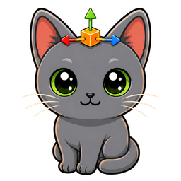
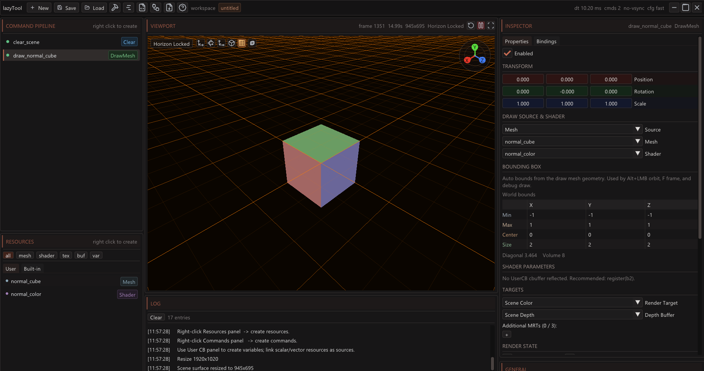

<p>
  <sub><sub>
    
  </sub></sub>
  <h1>lazyTool</h1>
</p>


**lazyTool** is an experimental DirectX 11 editor for building real-time graphics scenes. It is made for people who want to assemble an image step by step, see which resources each step uses, tweak values live, and export the result as a standalone executable.

It does not try to hide the technical side. The goal is that you can open the tool, look at the resource list, look at the command list, select something, and understand what is happening.



## What You Can Do

- View a live scene in the viewport.
- Create visual resources and internal GPU buffers.
- Chain render commands in an ordered frame pipeline.
- Clear targets, draw, run compute work, and organize commands into groups.
- Edit parameters from panels without rebuilding the whole application.
- Move the camera, enable a grid, frame objects, and use transform controls.
- Read warnings, errors, and useful messages in the log.
- Inspect relationships between commands and resources in a graph view.
- Animate values, camera state, lights, and command state with a timeline.
- Export a scene as a standalone executable.
- Generate a stricter 64k/procedural build when the content allows it.

## Who It Is For

lazyTool can be useful if you are learning real-time rendering, prototyping visual effects, exploring procedural graphics, or working on compact executable demos.

You do not need to understand the entire engine to start. A good first approach is to open a simple scene, select commands and resources, change values, and watch what happens in the viewport.

## Interface Overview

| Area | What It Does |
|---|---|
| **Viewport** | Shows the final image, camera controls, grid, and transform helpers. |
| **Resources** | Holds textures, render targets, buffers, meshes, values, and built-in resources. |
| **Command Pipeline** | Lists the steps that run every frame. |
| **Inspector** | Edits the selected resource or command. |
| **User CB** | Edits values sent to the GPU as parameters. |
| **Render Graph** | Helps you see which command reads or writes each resource. |
| **Timeline** | Animates values and states with keyed clips. |
| **Log** | Shows errors, warnings, validation messages, and export output. |

## Basic Workflow

1. Open lazyTool.
2. Look at the viewport to see the current result.
3. Select a resource or command.
4. Change values in the Inspector.
5. Use the log if something does not look right.
6. Save the `.lt` file.
7. Export an executable when you want to share the scene.

The `.lt` file is plain text. That makes scenes easier to review, version, and understand.

## Resources

Resources are the pieces used by the scene. They can be simple values, textures, internal targets, buffers, meshes, or built-in data such as scene color, depth, time, and shadow maps.

Keeping resources visible makes it easier to answer simple questions: what exists in the scene, what is selected, and what a command is using.

## Commands

Commands are the steps of the frame. They run in order and form the main pipeline.

Some commands clear a texture, some draw, some run compute work, and some group or repeat other steps. This makes the frame easier to inspect: if something goes wrong, you can usually find the exact step that produced it.

## Timeline

The timeline lets you animate values without writing new code for every change. It can drive parameters, command on/off state, transforms, camera state, and directional light state.

It is meant for quick iteration: add keys, play the scene, adjust, and repeat.

## Render Graph

The Render Graph is not the main way to edit a scene. It is a debugging view.

It shows dependencies: which command writes a resource, which command reads it later, where an intermediate texture appears, and why a pass may be using something unexpected.

## Export

lazyTool has two output paths:

| Output | Use |
|---|---|
| **Normal export** | Creates a standalone executable with the required data. |
| **build64k** | Generates a compact C player for procedural scenes and removes unused runtime features. |

The 64k path is intentionally stricter. It is designed to reduce size and keep only what is needed. If a scene does not use timeline data, compute work, buffers, or draw commands, those parts do not need to be included in the generated player.

## Building

You need Windows, Visual Studio with MSVC, the Windows SDK, and a DirectX 11 capable GPU.

Open a **Developer Command Prompt for Visual Studio** in the repository folder and run:

```bat
build.bat
```

You can also choose a build profile:

```bat
build.bat fast
build.bat profile
build.bat release
```

The build writes executables to `bin/` and launches the editor.

## Useful Shortcuts

| Shortcut | Action |
|---|---|
| `F5` | Recompile what is needed to refresh the scene. |
| `Ctrl+S` | Open saving for the current file. |
| `Space` | Pause or play the scene. |
| `F6` | Restart scene time. |
| `F11` | Toggle viewport fullscreen. |
| `Delete` | Delete the selected item. |

## Current State

lazyTool is experimental. Some parts are intentionally direct and technical because the goal is to learn, iterate, and keep the rendering pipeline visible.

If you are just starting, change a few values at a time and watch the result. The editor is designed so you can explore without understanding every system on day one.

## Important Folders

| Folder | Contents |
|---|---|
| `src/` | Editor, runtime, and core systems. |
| `assets/` | Assets used by the application. |
| `docs/` | Screenshots and supporting documentation. |
| `build64k/` | Compact procedural exporter and generated-player code. |
| `external/` | Third-party dependencies included with the repository. |

## Licenses And Dependencies

The code uses common C/C++ graphics libraries including Dear ImGui, stb, cgltf, and NanoSVG. The interface icons use Lucide; its license is in `assets/icons/LUCIDE-LICENSE.txt`.
